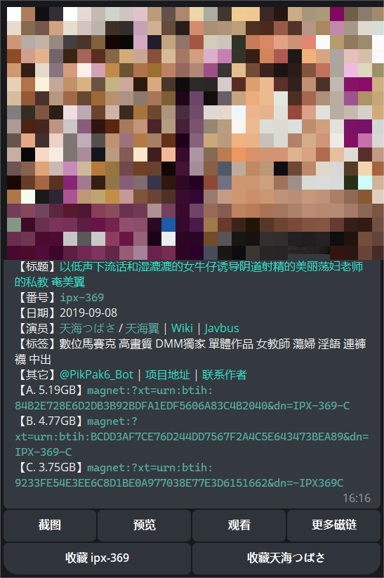

# tg-jav-bot

**一个万能 Telegram 番号查询机器人。基于 Javbus，Sukebei，Avgle，Dmm，Javlibrary，维基百科，谷歌翻译等进行构建，集成了 Pikpak 作为磁链保存网盘。**

欢迎 issue 和 pr，也可通过邮箱 [akynazh@qq.com](mailto://akynazh@qq.com) 或电报 [@jackbryant286](https://t.me/jackbryant286) 联系我。

从该项目分离出的一个爬虫子项目：[jvav](https://github.com/akynazh/jvav)，已经发布到 pypi，现在作为本项目的包依赖，同时可以服务于更多应用。

一个基于本项目并提供更多功能（包括写备注, 在群组中使用, 导入记录等等）的机器人: [@tg-jav-bot-plus](https://t.me/zh_jav_plus_bot), 不会部署或者懒得部署的（部署过程还是挺麻烦的）可以考虑使用这个。如果你还是想自己部署，但过程中出现了问题不知道怎么解决，请先利用好搜索引擎和 AI 帮你解决问题，最后再私信或者提 issue 让别人帮你解决。

## 功能简介

**主要功能：**

发送给机器人一条含有番号的消息，机器人会匹配并通过 Javbus 和 Sukebei 搜索消息中所有符合“字母-数字”格式的番号（其它格式的番号可通过 /av 命令查找）。如果搜索到结果，将返回番号对应 av 的封面，标题，日期，演员，磁链等。

**附加功能：**

以下功能按开发完成时间进行排序，后续有新功能将持续补充。

- 支持配置代理 - 2022/11/26
- 支持过滤磁链（过滤顺序：无码，高清，有字幕）- 2022/11/26
- 支持让机器人自动将最优磁链发送到 Pikpak（随机获取时不会自动发送）- 2022/12/29
- 支持通过 Avgle 获取预览视频和完整视频 - 2022/12/31
- 支持通过 Javbus 获取影片截图 - 2023/01/01
- 支持收藏演员和番号 - 2023/01/04
- 支持通过 docker 部署 - 2023/01/08
- 支持通过 Dmm 获取预览视频，女优排行榜，av 评分 （由于 DMM 限制，只支持日本 IP）- 2023/01/20
- 支持通过 Javlibrary 各种排行榜随机获取番号 - 2023/01/25
- 支持通过 Javbus 获取演员最新 av，随机获取演员 av - 2023/01/25
- 支持通过维基百科获取演员中文名 - 2023/02/18
- 支持通过谷歌翻译日文标题 - 2023/02/18
- 支持通过 Javbus 和维基百科以日文或中文搜索演员（演员名称需要和维基对应词条一致）- 2023/02/18
- 支持通过 Dmm 随机获取女优高分 av - 2023/03/03
- 支持通过 Redis 进行缓存 - 2023/03/17
- 支持通过 Javbus 进行模糊搜索女优 - 2023/04/20

注：配置，记录和日志等文件存放在 `~/.tg_jav_bot` 目录下。

**机器人指令：**

```
/help  查看指令帮助

/stars  查看收藏的演员

/avs  查看收藏的番号

/nice  随机获取一部高分 av

/new  随机获取一部最新 av

/rank  获取 DMM 女优排行榜

/record  获取收藏记录文件

/star  后接演员名称可搜索该演员

/av  后接番号可搜索该番号
```

**部分结果展示：**



## 使用教程

首先需要下载本项目代码到本地。

### 配置机器人

编辑 `~/.tg_jav_bot/config.yaml`：

```yaml
# TG 对话 ID
tg_chat_id: 
# TG 机器人 Token
tg_bot_token: 
# TG 机器人名称
tg_bot_name:
# 全局是否使用代理 1 是 | 0 否
use_proxy: 
# 访问 dmm 时是否使用代理，如果全局使用代理，则忽略该字段 1 是 | 0 否
use_proxy_dmm: 
# 代理服务器地址，如果不使用代理，则忽略该字段
proxy_addr: 
# 是否使用 Pikpak 自动发送功能 1 是 | 0 否
use_pikpak: 
# 配置 TG API，如果不使用 Pikpak 自动发送功能，则忽略以下两个字段，可在这里申请 API: https://my.telegram.org/apps
tg_api_id: 
tg_api_hash: 
# 是否使用缓存 1 是 | 0 否
use_cache: 
# redis 地址，如果不使用缓存，则忽略以下两个字段
redis_host: 
redis_port: 
```

如需使用 Pikpak 自动发送功能，需要先手动授权 [Pikpak 官方机器人](https://t.me/PikPak6_Bot)，然后在初次运行机器人时进行登录操作。

### 运行机器人

**通过 docker 运行：**

```
docker-compose up -d
```

**或通过普通方法运行：**

```
# 如果使用缓存的话需先开启 redis 服务
# Python >=3.7
pip install -r requirements.txt
python3 bot.py
```

### 更新机器人

首先拉取最新代码。

接着，如果是使用 docker 进行部署，则重新构建镜像并运行即可，参考命令：

```
docker-compose down && docker-compose up -d --build
```

如果是使用普通方法部署，则需要先更新 jvav 这个包，然后再运行机器人。